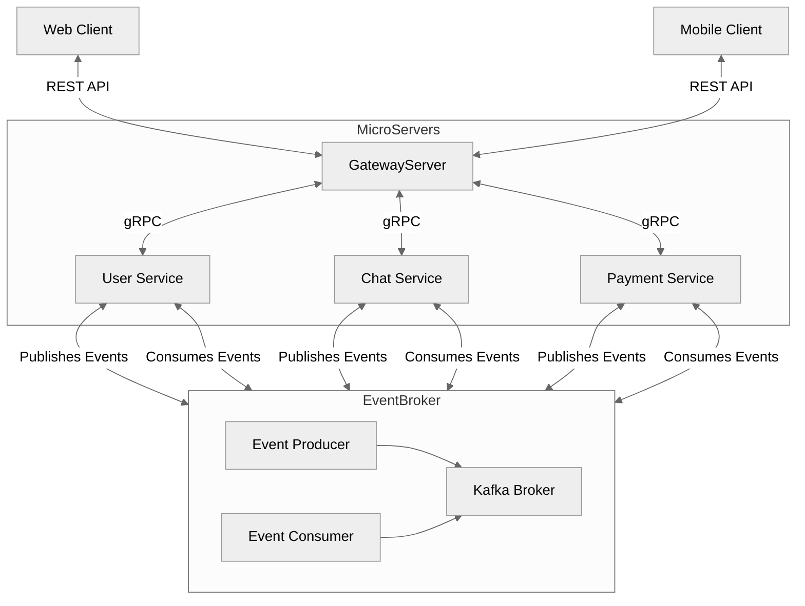

# hearlers-api

## 1. 서비스 개요

event-driven-architecture를 기반으로 하여 확장성 있는 애플리케이션을 추구합니다.

추후 AI 모델 서빙 서버를 구축 시, 일반적인 서비스 서버와 엮였을 때 발생할 수 있는 **리소스 경쟁** 및 **확장성 문제**에 대비하기 위해 손쉬운 분할이 가능한 EDA를 메인 테마로 개발합니다.

기본적으로는 클라이언트와 소통하는 gateway-server와 내부 로직을 수행하는 service-server 2개로 구성합니다.

이는 단일 진입점 제공 및 내부 서비스와의 독립성을 보장할 수 있음과 동시에 EDA 아키텍처를 구현한 순간 gateway를 나누는 것의 구현 복잡도가 낮기 때문 입니다.

CQRS 패턴은 1단계 (command 및 query 로직의 분리)까지만 우선 적용합니다. 비즈니스가 확장되면 no-sql queryDB및 query 서버로 분리합니다.

| Category               | description                                                                                         |
| ---------------------- | --------------------------------------------------------------------------------------------------- |
| Concepts               | Domain Driven Design (Subdomains, Bounded Contexts, Ubiquitous Language, Aggregates, Value Objects) |
| Architecture style     | Event Driven Microservices                                                                          |
| Architectural patterns | CQRS                                                                                                |
| Technology             | Flask, Kafka, PostgreSQL                                                                            |

## 1. 요구사항

- docker
- docker-compose

## 2. 실행 방법

### 2.1. RUN(LOCAL)

```bash
git submodule update --init --recursive
```

> 로컬에서 실행 시 kafka와 zookeeper가 실행 중이여야 합니다.

```bash
make kafka
make run
```

### 2.1. Deploying(DEV)

```bash
docker-compose -f docker/docker-compose.yaml up --build
```

## 3. 서비스 구조도

### 3.1 통신 구조



<!-- ### 3.2 작업 방식 -->

## 4. 서비스 설계

모든 서비스는 도메인 주도 설계의 원칙 아래, 바운디드 컨텍스트 단위로 설계한다. 초기 서비스는 팀의 규모 및 생산성을 고려해여 분리를 하며, 서비스 분리를 하는 우선순위는 다음과 같다.

1. **비즈니스 도메인별 독립성**
   비즈니스 상 독립적인 팀이 나눠 작업할 필요가 있는 지
2. **바운디드 컨텍스트의 크기**
   큰 도메인은 한 서비스로 유지하면 복잡성이 높아지고 관리가 어려워지므로 바운디드 컨텍스트를 기준으로 분리
3. **프레임워크 및 언어의 분리 필요성**
   기술적 요구사항이 분리된 경우 각 서비스가 적합한 언어와 프레임워크를 사용하여 최적화된 성능과 확장성을 제공
4. **서비스의 배포 및 확장 필요성**
   서비스의 변경 주기가 빠른 기능이 여러 팀에 영향을 미치지 않도록 독립된 서비스로 관리
5. **데이터 저장소 및 처리 방식의 차이**
   서로 다른 데이터 스토리지를 사용하는 경우. (분석 데이터와 비즈니스 데이터의 분리 등)
