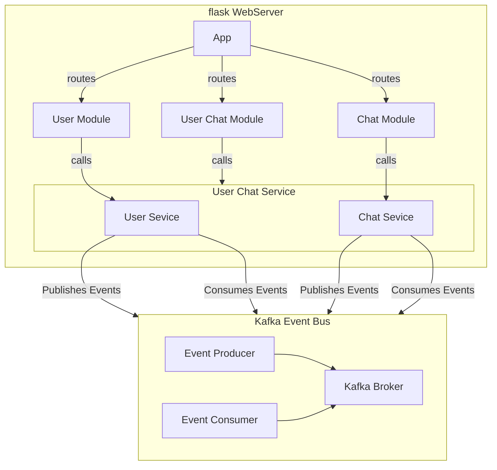
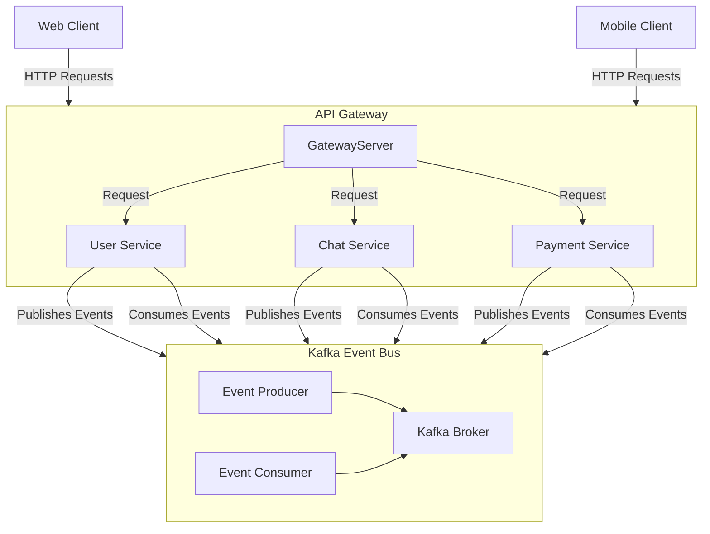
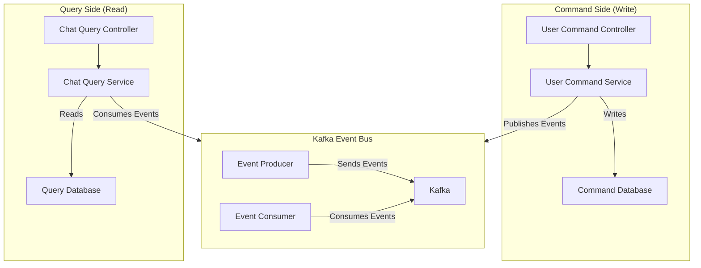

# hearlers-api

## 1. 서비스 개요

event-driven-architecture를 기반으로 하여 확장성 있는 애플리케이션을 추구합니다.

추후 AI 모델 서빙 서버를 구축 시, 일반적인 서비스 서버와 엮였을 때 발생할 수 있는 **리소스 경쟁** 및 **확장성 문제**에 대비하기 위해 손쉬운 분할이 가능한 EDA를 메인 테마로 개발합니다.

기본적으로는 클라이언트와 소통하는 gateway-server와 내부 로직을 수행하는 service-server 2개로 구성합니다.

이는 단일 진입점 제공 및 내부 서비스와의 독립성을 보장할 수 있음과 동시에 EDA 아키텍처를 구현한 순간 gateway를 나누는 것의 구현 복잡도가 낮기 때문 입니다.

CQRS 패턴은 1단계 (command 및 query 로직의 분리)까지만 우선 적용합니다. 비즈니스가 확장되면 non-sql queryDB및 query 서버로 분리합니다.

| Category               | description                                                                                         |
| ---------------------- | --------------------------------------------------------------------------------------------------- |
| Concepts               | Domain Driven Design (Subdomains, Bounded Contexts, Ubiquitous Language, Aggregates, Value Objects) |
| Architecture style     | Event Driven Microservices                                                                          |
| Architectural patterns | CQRS                                                                                                |
| Technology             | Flask, Kafka, PostgreSQL                                                                            |

## 1. 요구사항

- docker
- docker-compose

## 2. 실행 방법

### 2.1. RUN(LOCAL)

> 로컬에서 실행 시 kafka와 zookeeper가 실행 중이여야 합니다.

```bash
$ ./start.sh
```

### 2.1. Deploying(DEV)

```bash
$  docker-compose -f docker/docker-compose.yaml up --build
```

## 3. 서비스 구조도

### 3.1 단일 서버 구성 시



### 3.2 MSA 전환 시



### 3.3. CQRS 구조도



## 4. 서비스 설계

모든 서비스는 단방향 의존 관계를 갖도록 설계해서 상호 참조 문제가 발생하지 않도록 한다. 상호참조가 필요한 경우 그 부분만 별도의 서비스로 만들거나 두 서비스를 하나로 합쳐야 한다. 이 규칙은 서비스, 모듈, 클래스 등 규모에 상관없이 동일하게 적용된다.

### 4.1. 서비스의 분리

이 프로젝트의 서비스는 크게 **Core Serivce**와 **Application Service**로 나눈다

**Core Serivce**의 특징은 다음과 같다.

> 다른 서비스에 존재하지 않는 독립적인 repository를 가진다.
> 다른 서비스를 참조하지 않는다.

**Application Service**의 특징은 다음과 같다.

> repository가 존재하지 않거나 다른 서비스에 존재하는 데이터로 생성 가능한 데이터를 가진다. 다른 서비스를 참조할 수 있다.
